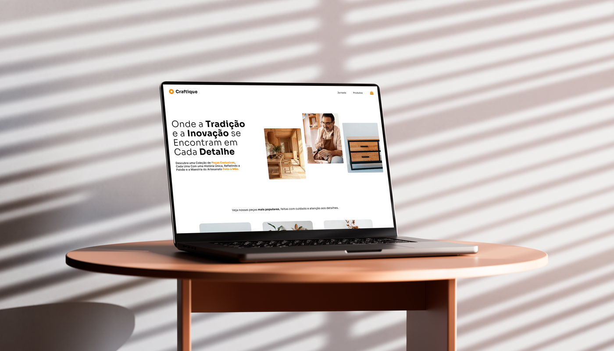

# Craftique

Craftique é um projeto de uma loja virtual de artesanato. O site tem como objetivo apresentar peças artesanais de forma única, com uma interface moderna e intuitiva. Ele oferece uma experiência agradável para quem deseja conhecer e adquirir peças artesanais exclusivas, com uma página dedicada à biografia dos artesãos.

## Tecnologias Utilizadas:
- HTML5
- Tailwind CSS
- Heroicons (para ícones)
- Figma
  
## Funcionalidades:
- Página Principal: Uma apresentação inicial com destaque para as peças artesanais.
- Página "Jornada": Biografia dos artesãos, contando sua história e inspirações.
- Página de Detalhes do Produto: Informações detalhadas sobre cada peça, com imagens e descrições completas.
- Ícones Personalizados: Utilização da biblioteca Heroicons para uma experiência visual mais agradável.
- Design Moderno: Interface agradável, com foco na estética visual.
- Acessível: Layout simples e de fácil navegação para todos os tipos de usuários.

## Melhorias Futuras
- Responsividade: Implementar layout responsivo para dispositivos móveis.
- Integração com sistema de carrinho: Possibilidade de adicionar produtos ao carrinho e finalizar compras.
- Filtragem de Produtos: Opções para filtrar as peças por tipo, material ou preço.

## Informações adicionais
Apresentação no behance: https://www.behance.net/matheusmpz

Para perguntas ou feedback, sinta-se à vontade para entrar em contato:

E-mail: matheus.psoares4@gmail.com
LinkedIn: https://www.linkedin.com/in/matheusmpz/
Este projeto é de uso pessoal e não deve ser utilizado sem a minha autorização.
